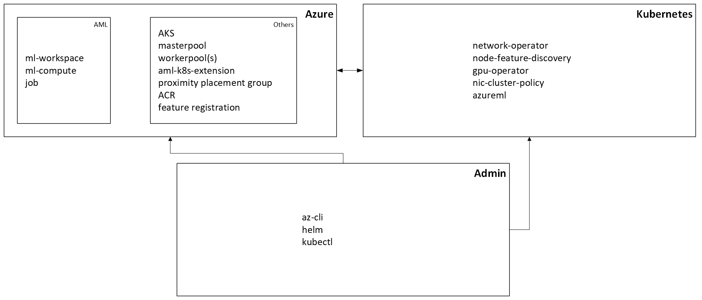

# AML as Orchestrator for your AKS GPU Infiniband Clutser

This tutorial will take you through creating an AML (Azure Machine Learning) compute backed by an AKS (Azure Kubernetes Service) cluster and running a distributed AML job on it with Infiniband support.

Here is a diagram showing the high level setup architecture:

## Contents
- `main.ipynb`: Step-by-step tutorial for setting up and running distributed training jobs on AKS with Infiniband.
- `env.yaml`, `job.yaml`, `instance_type.yaml`, and other YAML files: Configuration files for AzureML and Kubernetes resources.

## Quick Start
1. Follow the instructions in `main.ipynb` to:
   - Set up your admin machine (Linux recommended)
   - Prepare Azure resources
   - Deploy and configure the AKS cluster with Infiniband
   - Install required Kubernetes and AzureML components
   - Attach the cluster to AzureML and validate Infiniband performance
   - Submit AML Job for NCCL test.

## Reference
See the notebook and YAML files for detailed, step-by-step instructions and explanations.
